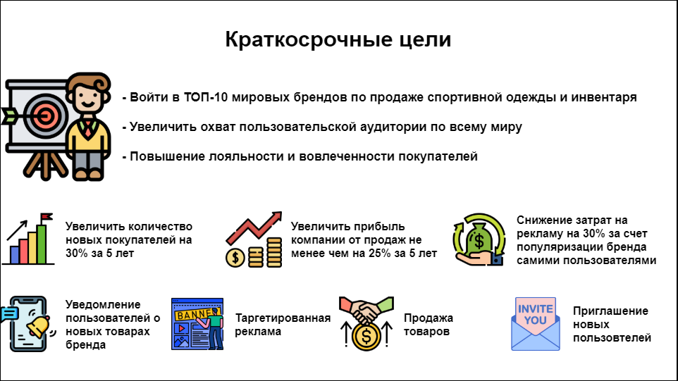
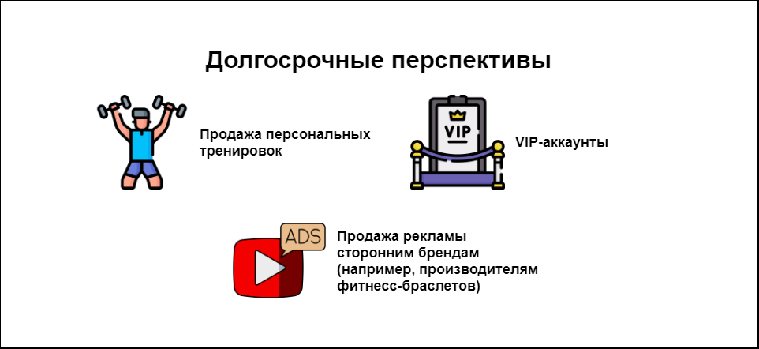

# Краткосрочные цели разработки приложения (5 лет)
## Стратегические цели
- Войти в топ-10 мировых брендов по продаже спортивной одежды и инвенторя
- Увеличить охват пользовательской аудитории по всему миру
- Повышение лояльности и вовлеченности покупателей

## Операционные цели
- Увеличить количество новых покупателей на 30% за 5 лет
- Увеличить прибыль компании от продаж не менее чем на 25% за 5 лет
- Снижение затрат на рекламу не менее чем на 30% за счет популяризации бренда самими пользователями

## Бизнес-цели
- Уведомление пользователей о новых товарах бренда
- Таргетированная реклама
- Продажа товаров
- Привлечение новых клиентов имеющимися пользователями

# Развитие (долгосрочные перспективы)
- Продажа персональных тренировок
- VIP-аккаунты
- Реклама интвентаря, который не производит наш бренд (например, фитнес-браслеты)

