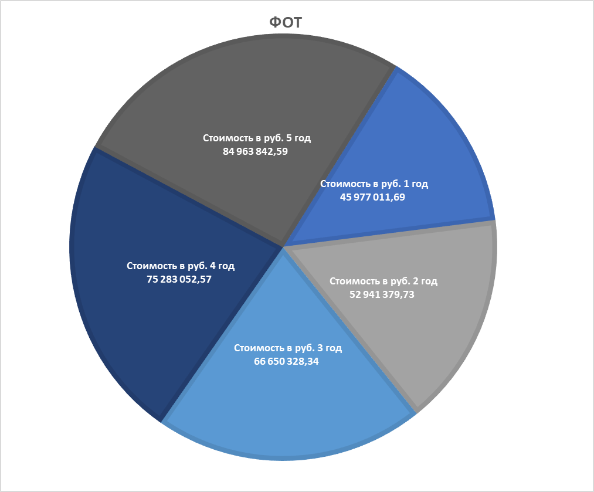

# Стоимость владения
## ФОТ команды
Состав команды для разработки:

| Роль / должность                                             | Стоимость в руб. | Количество |
|--------------------------------------------------------------|------------------|------------|
| Системный/бизнес аналитик (совмещающий роль Product manager) | 402 298,85       | 1          | 
| Middle аналитик                                              | 172 413,79       | 1          | 
| Lead разработчик (совмещающий роль Product owner)            | 425 287,36       | 1          | 
| Middle разработчик (2 back-end, 2 front-end)                 | 206 896,55       | 4          | 
| Тестировщик-автоматизатор                                    | 160 919,54       | 1          | 
| Тестировщик                                                  | 114 942,53       | 2          | 
| Итого в месяц в первый год                                   | 2 218 390,8      |            | 
| Итого в 1 год (+ премия в размере 1 ФОТ)                     | 28 839 080,4     |            | 
| Итого в 2 год (с премией и 5% пересмотром ФОТ)               | 30 281 034,42    |            | 
| Итого в 3 год (с премией и 5% пересмотром ФОТ)               | 31 795 086,14    |            | 
| Итого в 4 год (с премией и 5% пересмотром ФОТ)               | 33 384 840,45    |            | 
| Итого в 5 год (с премией и 5% пересмотром ФОТ)               | 35 054 082,47    |            | 
| Итого за 5 лент                                              | 159 354 123,9    |            | 

Продукт должен быть приятен и удобен для использования пользователями, что, несомненно, означает, что:
1. необходимо оплатить работу дизайн-студии за разработку библиотеки элементов и дизайн-проект приложения и web-портала;
2. нанять технического писателя - редактора, контролирующего единообразность текстов, владеющий языковой базой;
3. нанять проектировщика - исследователя пользовательского опыта.

Дизайн-проект обойдется приблизительно в 1 000 000 руб.

| Роль / должность                                  | Стоимость в руб. | Количество |
|---------------------------------------------------|------------------|------------|
| Редактор                                          | 287 356,32       | 1          | 
| Проектировщик                                     | 229 885,06       | 1          |
| Итого в месяц в первый год                        | 517 241,38       |            | 
| Итого в 1 год (+ премия в размере 1 ФОТ)          | 6 724 137,94     |            | 
| Итого в 2 год (с премией и 5% пересмотром ФОТ)    | 7 127 586,21     |            | 
| Итого в 3 год (с премией и 5% пересмотром ФОТ)    | 7 555 241,39     |            | 
| Итого в 4 год (с премией и 5% пересмотром ФОТ)    | 8 008 555,87     |            | 
| Итого в 5 год (с премией и 5% пересмотром ФОТ)    | 8 489 069,22     |            | 
| Итого за 5 лент                                   | 37 904 590,64    |            | 

Размер службы поддержки и сопровождения зависит от этапа развития продукта, т.е. подлежит увеличению.
Служба состоит из:
- инженера;
- 1 линии поддержки (call-center, разбор инцидентов);
- 2 линия - эксплуатация, поддержка, сбор отчетов.

| Роль / должность                               | Стоимость в руб. | Количество в 1 год | Количество в 2 год | Количество в 3 год | Количество в 4 год | Количество в 5 год |
|------------------------------------------------|------------------|--------------------|--------------------|--------------------|--------------------|--------------------|
| 1 линия поддержки                              | 34 482,76        | 5                  | 15                 | 30                 | 40                 | 50                 | 
| 2 линия поддержки                              | 68 965,52        | 5                  | 6                  | 8                  | 10                 | 10                 | 
| Инженер                                        | 206 896,55       | 1                  | 1                  | 2                  | 2                  | 3                  | 
| Итого в месяц в первый год                     | 724 137,95       |                    |                    |                    |                    |                    | 
| Итого в 1 год (+ премия в размере 1 ФОТ)       | 9 413 793,35     |                    |                    |                    |                    |                    | 
| Итого в 2 год (с премией и 5% пересмотром ФОТ) | 15 532 759,10    |                    |                    |                    |                    |                    | 
| Итого в 3 год (с премией и 5% пересмотром ФОТ) | 27 300 000,81    |                    |                    |                    |                    |                    | 
| Итого в 4 год (с премией и 5% пересмотром ФОТ) | 33 889 656,25    |                    |                    |                    |                    |                    | 
| Итого в 5 год (с премией и 5% пересмотром ФОТ) | 41 420 690,90    |                    |                    |                    |                    |                    | 
| Итого за 5 лент                                | 127 556 900,4    |                    |                    |                    |                    |                    | 

Итого по годам:

|                                 | Стоимость в руб. 1 год | Стоимость в руб. 2 год | Стоимость в руб. 3 год | Стоимость в руб. 4 год | Стоимость в руб. 5 год | Стоимость в руб. за 5 лет |
|---------------------------------|------------------------|------------------------|------------------------|------------------------|------------------------|---------------------------|
| Команла разработки              | 28 839 080,4           | 30 281 034,42          | 31 795 086,14          | 33 384 840,45          | 35 054 082,47          | 159 354 123,9             | 
| Дизайн-проект                   | 1 000 000              |                        |                        |                        |                        |                           | 
| Команда UX/UI                   | 6 724 137,94           | 7 127 586,21           | 7 555 241,39           | 8 008 555,87           | 8 489 069,22           | 37 904 590,64             | 
| Служба поддержки и эксплуатации | 9 413 793,35           | 15 532 759,10          | 27 300 000,81          | 33 889 656,25          | 41 420 690,90          | 127 556 900,4             | 
| Итого                           | 45 977 011,69          | 52 941 379,73          | 66 650 328,34          | 75 283 052,57          | 84 963 842,59          | **324 815 614,94**        | 

