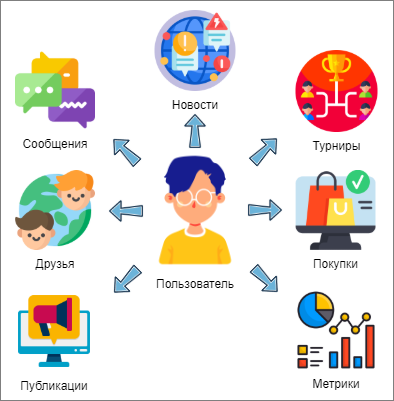
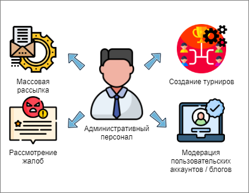

# Функциональные требования
## Общие требования
1. Должны быть разработаны интеграции:
   - с сервисом Google Sign-in для идентификации и аутентификации пользователя;
   - видеохостингом для хранения медиа-контента;
   - с сервисом магазина:
     * для получения уведомлений; 
     * для начисления бонусов;
     * для получения ссылки на категорию товаров;
     * для получения ссылки на конкретный товар;
     * для поиска конкретного товара.
   - с API носимых фитнесс-устройств (умные часы, браслеты) основных лидеров рынка (как минимум, Samsung, Apple, Huawei, Xiaomi);
   - с API основных мессенджеров (telegram, whatsapp, viber) для передачи ссылки на профиль.
2. Должна быть разработана гарантированная доставка данных из мобильного приложения на сервер;
3. Не должны храниться и обрабатываться персональные данные, попадающие под соответствующее законодательство;
4. Должна поддерживаться мультиязычность:
   1. русский,
   2. китайский,
   3. английский язык.
5. Должен быть разработан механизм автоматического цензурированиязаписей пользовательских публикаций.
## Требования к мобильному приложению для пользователей
1. Должна быть разработана функция поиска друзей:
   1. по виду спорта;
   2. по географической удаленности.
2. Должна быть разработана функция добавления в друзья;
3. Должна быть разработана функция передачи ссылки на профиль пользователя друзьям в месенджеры;
4. Должна быть разработана функция копирования ссылки на профиль пользователя в буфер обмена;
5. Должна быть разработана функция добавления в друзья по ссылке на пользователя;
6. Должна быть разработана функция отправки личного сообщения;
7. Должен быть разработан личный кабинет пользователя, который содержит:
    1. функциональность просмотра, удаления, отправки личных сообщений;
    2. предпочтительные виды спорта;
    3. подключение фитнес-трекеров;
    4. текущие метрики пользователя с возможностью поделиться ими;
    5. исторические метрики пользователя;
    6. текущие (активные) турниры, в которых пользователь участвует;
    7. история участия в турнирах;
    8. награды за участие в игровых турнирах;
    9. рекомендуемые для покупки товары;
    10. личный блог пользователя:
        1. добавление новых записей;
        2. удаление записей;
        3. комментирование записей.
    11. избранные блоги (с отметками о непрочитанных сообщениях);
    12. удаление блога из избранного;
    13. просмотр списка друзей;
    14. удаление пользователя из списка друзей.
8. Должен быть разработан раздел со списком блогов пользователей, включающий:
    1. поиск блогов по тематике;
    2. поиск блогов по региону;
    3. просмотр блога;
    4. подписку на блог (добавление блога в список избранных);
    5. отписка от блога (удаление блога из списка избранных);
    6. реакция на запись в блоге;
    7. комментарий к записи в блоге;
    8. функция "пожаловаться на некорректное содержимое".

## Требование к пользовательскому порталу
1. Должна быть разработана "облегченная" версия личного кабинета, которая содержит:
    1. функциональность просмотра, удаления, отправки личных сообщений;
    2. предпочтительные виды спорта;
    4. текущие метрики пользователя с возможностью поделиться ими;
    5. исторические метрики пользователя;
    6. текущие (активные) турниры, в которых пользователь участвует;
    7. история участия в турнирах;
    8. награды за участие в игровых турнирах;
    9. рекомендуемые для покупки товары;
    10. личный блог пользователя:
        1. добавление новых записей;
        2. удаление записей;
        3. комментирование записей.
    11. избранные блоги (с отметками о непрочитанных сообщениях);
    12. удаление блога из избранного;
    13. просмотр списка друзей;
    14. удаление пользователя из списка друзей.
2. Должен быть доступен раздел со списком блогов пользователей, включающий:
    1. поиск блогов по тематике;
    2. поиск блогов по региону;
    3. просмотр блога;
    4. подписку на блог (добавление блога в список избранных);
    5. отписка от блога (удаление блога из списка избранных);
    6. реакция на запись в блоге;
    7. комментарий к записи в блоге;
    8. функция "пожаловаться на некорректное содержимое".
## Требование к административному порталу
1. Должен быть разработан административный портал для выполнения функций модерирования контента;
2. В административном портале должны быть доступны следующие функции:
   1. создание турниров:
      1. региональных;
      2. по спортивной категории;
      3. мировых.
   2. планирование времени автоматического запуска и остановки турнира;
   3. блокировка пользовательского аккаунта;
   4. разблокировка пользовательского аккаунта;
   5. временная блокировка пользовательского аккаунта;
   6. блокировка пользовательского блога;
   7. разблокировка пользовательского блога;
   8. временная блокировка пользовательского блога;
   9. удаление блога пользователя;
   10. удаление комментария пользователя;
   11. блокировка возможности пользователем комментировать записи;
   12. разблокировка возможности пользователем комментировать записи;
   13. временная блокировка возможности пользователем комментировать записи;
   14. массовая рассылка уведомлений и новостей:
       1. региональных;
       2. всем пользователям;
       3. по категориям;
       4. персональная.
   15. просмотр жалоб пользователей по категориям. 
3. Должна быть реализована ролевая модель:
   1. администратор с доступом к полной функциональности;
   2. модератор с доступом к функциональности рассмотрения жалоб и различного рода блокировок и разблокирок;
   3. тренер с доступом к массовым рассылкам и уведомлениям, ведение блога.
