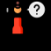

# Анализ стейкхолдеров и их интересов
Стейкхолдер | Влияние                               | Интересы
--- |---------------------------------------| ---
 Владелец компании | Максимальное                          | Получение прибыли от инвестиций
 Пользователи | Максимальное                          | Развлечение, общение, получение выгоды (бонусы, подарки, награды)
 Администраторы | Отрицательно настроенные              | Дополнительная нагрузка
 Модераторы | Отрицательно настроенные              | Дополнительная нагрузка
 Тренер | Влиятельные, положительно настроенные | Удобная площадка для продажи устройств
 Производство | Низкое                                | Стратегическое планирование на основе пользовательских интересов

